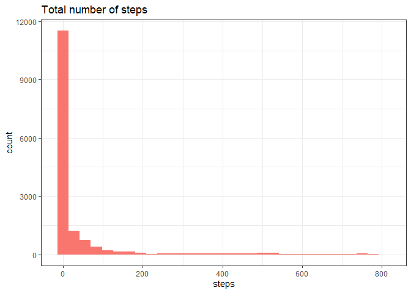
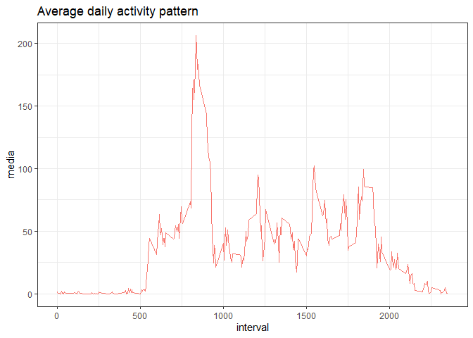
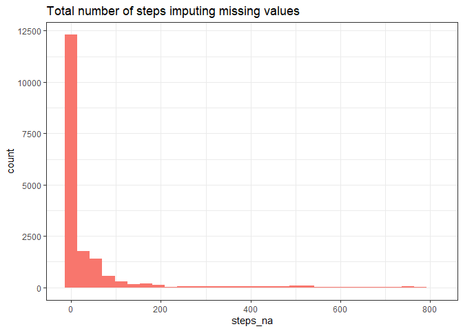
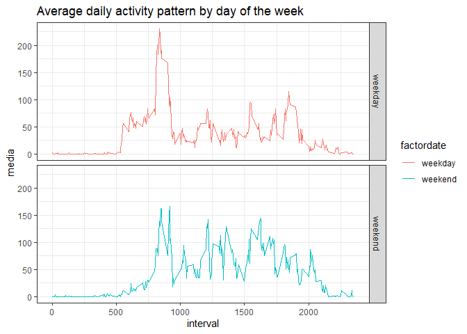

## Loading and preprocessing the data

This assignment makes use of data from a personal activity monitoring device. This device collects data at 5 minute intervals through out the day. The data consists of two months of data from an anonymous individual collected during the months of October and November 2012, and include the number of steps taken in 5 minute intervals each day.

The first thing to do is load the data using read.csv()


```r
unzip("./activity.zip")
activity <- read.csv("./activity.csv", header = TRUE, sep = ",")
```


Next, to process/transform the data into a format suitable for the analysis. I create a "day" column in the data frame regarding I will need it for multiple assignments.


```r
library(dplyr)
```

```
## 
## Attaching package: 'dplyr'
```

```
## The following objects are masked from 'package:stats':
## 
##     filter, lag
```

```
## The following objects are masked from 'package:base':
## 
##     intersect, setdiff, setequal, union
```

```r
activity <- activity %>%
  mutate(Day= format(as.Date(date), format = "%d")) 
```


## What is mean total number of steps taken per day?

For this part of the assignment, you can ignore the missing values in the dataset.

* Make a histogram of the total number of steps taken each day


```r
library(ggplot2)

ggplot(activity,aes(steps,fill="red"))+
  geom_histogram()+
  theme_bw()+
  ggtitle("Total number of steps")+
  theme(legend.position="none")
```

```
## `stat_bin()` using `bins = 30`. Pick better value with `binwidth`.
```

```
## Warning: Removed 2304 rows containing non-finite values (stat_bin).
```

<!-- -->

* Calculate and report the mean and median total number of steps taken per day


```r
tabla <- activity %>%
  group_by(Day) %>%
  summarise(mean=mean(as.numeric(steps),na.rm=TRUE), median=median(as.numeric(steps),na.rm=TRUE))
```

```
## `summarise()` ungrouping output (override with `.groups` argument)
```

```r
library(knitr)

kable(tabla)
```


|Day |     mean| median|
|:---|--------:|------:|
|01  |      NaN|     NA|
|02  | 18.62153|      0|
|03  | 38.06076|      0|
|04  | 42.06944|      0|
|05  | 41.20312|      0|
|06  | 41.23958|      0|
|07  | 41.48958|      0|
|08  | 11.17708|      0|
|09  | 44.48264|      0|
|10  | 34.37500|      0|
|11  | 39.77778|      0|
|12  | 48.86632|      0|
|13  | 34.30903|      0|
|14  | 52.42361|      0|
|15  | 17.67361|      0|
|16  | 35.63368|      0|
|17  | 48.24826|      0|
|18  | 43.69097|      0|
|19  | 35.88542|      0|
|20  | 25.81076|      0|
|21  | 37.51389|      0|
|22  | 58.83160|      0|
|23  | 52.27778|      0|
|24  | 39.64062|      0|
|25  | 24.87153|      0|
|26  | 31.14583|      0|
|27  | 41.25868|      0|
|28  | 37.57118|      0|
|29  | 20.94618|      0|
|30  | 34.09375|      0|
|31  | 53.52083|      0|

## What is the average daily activity pattern?

* Make a time series plot (i.e. type = "l") of the 5-minute interval (x-axis) and the average number of steps taken, averaged across all days (y-axis)


```r
avdaily <- activity %>%
  group_by(interval) %>%
  summarise(media=mean(as.numeric(steps),na.rm=TRUE))
```

```
## `summarise()` ungrouping output (override with `.groups` argument)
```

```r
ggplot(avdaily,aes(x=interval,y=media,colour="red"))+
  geom_line()+
  theme_bw()+
  ggtitle("Average daily activity pattern")+
  theme(legend.position="none")
```

<!-- -->

* Which 5-minute interval, on average across all the days in the dataset, contains the maximum number of steps? 


```r
maxstep <- activity %>%
  group_by(interval) %>%
  summarise(suma=sum(as.numeric(steps),na.rm=TRUE)) %>%
  arrange(desc(suma))
```

```
## `summarise()` ungrouping output (override with `.groups` argument)
```

The interval with the maximum number of steps is **835**

## Imputing missing values

There are a number of days/intervals where there are missing values (coded as NA). The presence of missing days may introduce bias into some calculations or summaries of the data.

* Calculate and report the total number of missing values in the dataset (i.e. the total number of rows with NAs)

The columns that has NAs is steps, and total rows with NAs are **2304**

* Devise a strategy for filling in all of the missing values in the dataset. *I use the the mean for that 5-minute interval*.

* Create a new dataset that is equal to the original dataset but with the missing data filled in.


```r
activity_na <- activity %>%
 inner_join(avdaily,by="interval") %>%
 mutate(steps_na=ifelse(is.na(steps),media,steps))
```

* Make a histogram of the total number of steps taken each day and Calculate and report the mean and median total number of steps taken per day. 


```r
ggplot(activity_na,aes(steps_na,fill="red"))+
  geom_histogram()+
  theme_bw()+
  ggtitle("Total number of steps imputing missing values")+
  theme(legend.position="none")
```

```
## `stat_bin()` using `bins = 30`. Pick better value with `binwidth`.
```

<!-- -->


```r
tabla_na <- activity_na %>%
  group_by(Day) %>%
  summarise(mean=mean(as.numeric(steps_na),na.rm=TRUE), median=median(as.numeric(steps_na),na.rm=TRUE))
```

```
## `summarise()` ungrouping output (override with `.groups` argument)
```


```r
kable(tabla_na)
```


|Day |     mean|     median|
|:---|--------:|----------:|
|01  | 37.38260| 34.1132075|
|02  | 18.62153|  0.0000000|
|03  | 38.06076|  0.0000000|
|04  | 39.72602|  8.3207547|
|05  | 41.20312|  0.0000000|
|06  | 41.23958|  0.0000000|
|07  | 41.48958|  0.0000000|
|08  | 24.27984|  0.9433962|
|09  | 40.93262|  7.4339623|
|10  | 35.87880|  8.8490566|
|11  | 39.77778|  0.0000000|
|12  | 48.86632|  0.0000000|
|13  | 34.30903|  0.0000000|
|14  | 44.90311|  7.8962264|
|15  | 17.67361|  0.0000000|
|16  | 35.63368|  0.0000000|
|17  | 48.24826|  0.0000000|
|18  | 43.69097|  0.0000000|
|19  | 35.88542|  0.0000000|
|20  | 25.81076|  0.0000000|
|21  | 37.51389|  0.0000000|
|22  | 58.83160|  0.0000000|
|23  | 52.27778|  0.0000000|
|24  | 39.64062|  0.0000000|
|25  | 24.87153|  0.0000000|
|26  | 31.14583|  0.0000000|
|27  | 41.25868|  0.0000000|
|28  | 37.57118|  0.0000000|
|29  | 20.94618|  0.0000000|
|30  | 35.73817|  4.9056604|
|31  | 53.52083|  0.0000000|

* Do these values differ from the estimates from the first part of the assignment? 

Yes. Both the table and the histogram shows there is a difference when an imputation is made on NA.

* What is the impact of imputing missing data on the estimates of the total daily number of steps?

Total numer of steps without removing NA is **5.70608\times 10^{5}** and with NA imputation is **6.56738\times 10^{5}**. The data frame with NA imputation sum **15.09** **%** more steps than the previous one.

## Are there differences in activity patterns between weekdays and weekends?

Use the dataset with the filled-in missing values for this part.

* Create a new factor variable in the dataset with two levels, "weekday" and "weekend", indicating whether a given date is a weekday or weekend day.


```r
activity_days <- activity_na %>%
  mutate(dayofweek=weekdays(as.Date(date)))%>%
  mutate(factordate=as.factor(ifelse(dayofweek=="sábado","weekend",ifelse(dayofweek=="domingo","weekend","weekday"))))
```

* Make a panel plot containing a time series plot (i.e. type = "l") of the 5-minute interval (x-axis) and the average number of steps taken, averaged across all weekday days or weekend days (y-axis). 


```r
avdaily_days <- activity_days %>%
  group_by(interval,factordate) %>%
  summarise(media=mean(as.numeric(steps_na),na.rm=TRUE))
```

```
## `summarise()` regrouping output by 'interval' (override with `.groups` argument)
```

```r
ggplot(avdaily_days,aes(x=interval,y=media,colour=factordate))+
  geom_line()+
  facet_grid(rows="factordate")+
  theme_bw()+
  ggtitle("Average daily activity pattern by day of the week")
```

<!-- -->
